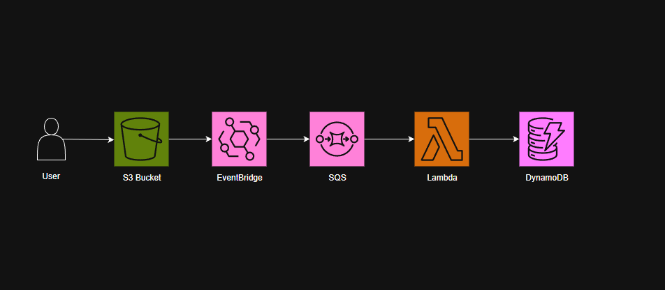

# AWS Photo Recognition Pipeline

## Overview

This project implements a complete AWS pipeline using Terraform and Lambda to process images uploaded to S3. It detects dogs and cats with Rekognition and stores metadata in DynamoDB. Through building this project, I gained hands-on experience with serverless architecture, infrastructure-as-code, and integrating multiple AWS services.

---

## Features

1. **S3 Bucket** – stores uploaded images.  
2. **SQS Queue + DLQ** – receives notifications for new S3 objects and handles failed events.  
3. **AWS Lambda** – processes SQS messages, analyzes images with Rekognition, and saves results to DynamoDB.  
4. **DynamoDB** – stores metadata for each image, including detected animals.

---

## Architecture Overview



## **Prerequisites**
Before deploying this project, ensure you have the following installed:

### **1. Install Terraform**
- Download Terraform from the official site: [Terraform Download](https://www.terraform.io/downloads)
- Install it by following the instructions for your OS.
- Verify installation by running:
  ```sh
  terraform -version
  ```

### **2. Configure AWS CLI**
- Install AWS CLI: [AWS CLI Installation](https://aws.amazon.com/cli/)
- Configure it with your AWS credentials:
  ```sh
  aws configure
  ```
  Provide your AWS **Access Key**, **Secret Key**, **Region**, and **Output Format**.

### **3. Set Up VS Code (Optional, but Recommended)**
- Install **VS Code**: [Download Here](https://code.visualstudio.com/)
- Install **Terraform Extension**: Search for `HashiCorp Terraform` in VS Code Extensions.

---

## **Project Structure**
```
aws-photo-recognition/
├── lambda/
│   └── lambda_function.py
├── terraform/
│   ├── main.tf              # Main Terraform configuration file
│   ├── s3.tf
│   ├── eventbridge.tf
│   ├── sqs.tf
│   ├── lambda.tf
│   └── dynamodb.tf
│── README.md                # Documentation

```

---

## **Deployment Guide**

### **Step 1: Clone the Repository**
```sh
git clone https://github.com/diana-mih/aws-photo-recognition.git
cd aws_photo_recognition
```

### **Step 2: Package the Lambda Function**

**On Windows, make sure you run the following command in PowerShell (not Git Bash):**

```powershell
cd lambda
Compress-Archive -Path lambda_function.py -DestinationPath lambda.zip -Force
```

### **Step 3: Initialize Terraform**
```powershell
cd ../terraform
terraform init
```
- Downloads necessary provider plugins.
- Sets up Terraform backend.

### **Step 4: Plan Deployment**
```powershell
terraform plan
```
- Shows what Terraform will create before applying changes.

### **Step 5: Apply Configuration**
```powershell
terraform apply
```
- Provisions AWS resources automatically.

### **Step 6: Access the Application**
- Upload an image of a dog or cat to the S3 input bucket.
- Lambda automatically processes the image with Rekognition.
- Results are stored in the DynamoDB table, including detected animal type and metadata.
- Optionally, check CloudWatch logs to monitor processing in real time.

### **Step 7: Destroy Resources (Optional)**
If you want to delete all resources:
```powershell
terraform destroy
```

---

## **Outputs**

After deployment, you can use the following resources:

- **S3 Input Bucket** – Upload images to trigger processing.  
- **DynamoDB Table** – Stores detected animal metadata.  
- **Lambda Function** – Processes images automatically.  
- **CloudWatch Logs** – Monitor execution and view processing details.

---

## **Terraform Concepts Covered in This Project**

- Building and managing AWS infrastructure declaratively.  
- Deploying and configuring **S3 buckets**, **Lambda functions**, **EventBridge rules**, **SQS queues**, and **DynamoDB tables**.  
- Understanding **Terraform state** and how resources are tracked.  
- Initializing, planning, applying, and destroying infrastructure safely with Terraform.  

---
